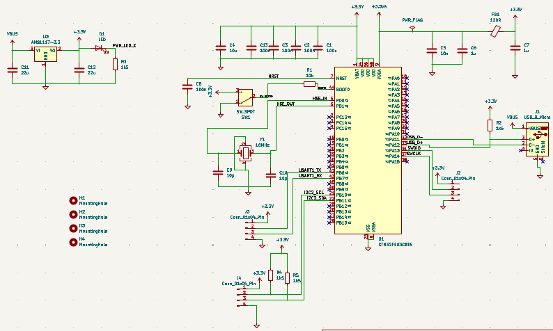
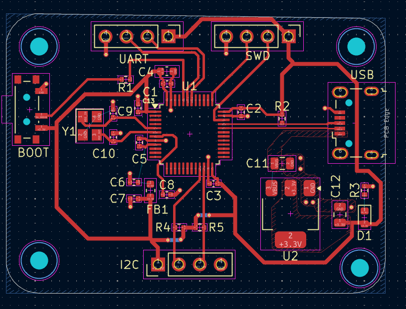
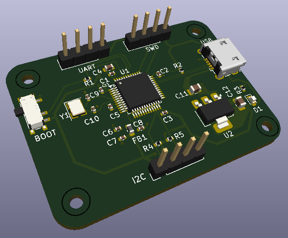

# STM32 Custom Development Board

A custom-designed STM32F103C8T6 development board featuring essential components for easy programming, communication, and expansion.

## Features
- USB Micro-B port for power and communication
- AMS1117-3.3 voltage regulator
- BOOT0 switch for programming mode selection
- 16 MHz external crystal oscillator
- SWD 4-pin header for programming/debugging
- I2C and UART pin headers for peripheral connections
- Compact and robust PCB design

## Hardware Overview

### Schematic View
The schematic includes the STM32F103C8T6 microcontroller, voltage regulation, USB interface, programming headers, and peripheral connectors.

### PCB Layout and Routing
The PCB is carefully routed to ensure stable operation, minimal noise, and good power distribution.

### 3D PCB View
A realistic 3D view of the assembled PCB.

## Components
- **Microcontroller:** STM32F103C8T6
- **Voltage Regulator:** AMS1117-3.3
- **Clock:** 16 MHz Crystal Oscillator
- **Communication:** USB Micro-B port, I2C header, UART header
- **Programming:** SWDIO 4-pin header, BOOT0 switch for mode selection

### Programming the Board
- Use an SWD programmer (such as ST-Link V2) connected to the SWDIO 4-pin header.
- Set the BOOT0 switch appropriately when flashing firmware:
  - **Programming mode:** BOOT0 = HIGH
  - **Normal operation:** BOOT0 = LOW

### Powering the Board
- Power can be provided through the USB Micro-B port or an external 5V supply.

### Pin Headers
- **I2C Header:** Connect external I2C peripherals.
- **UART Header:** Debug and communicate with other devices over UART.
